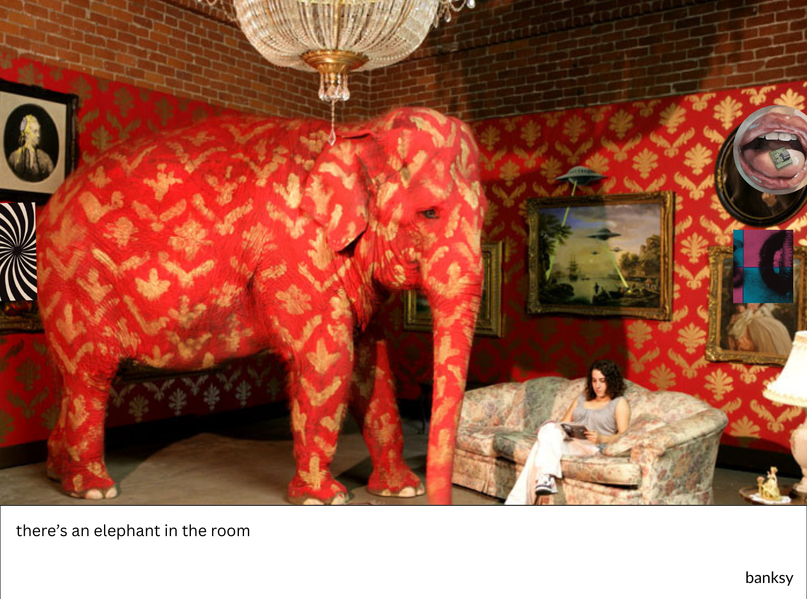
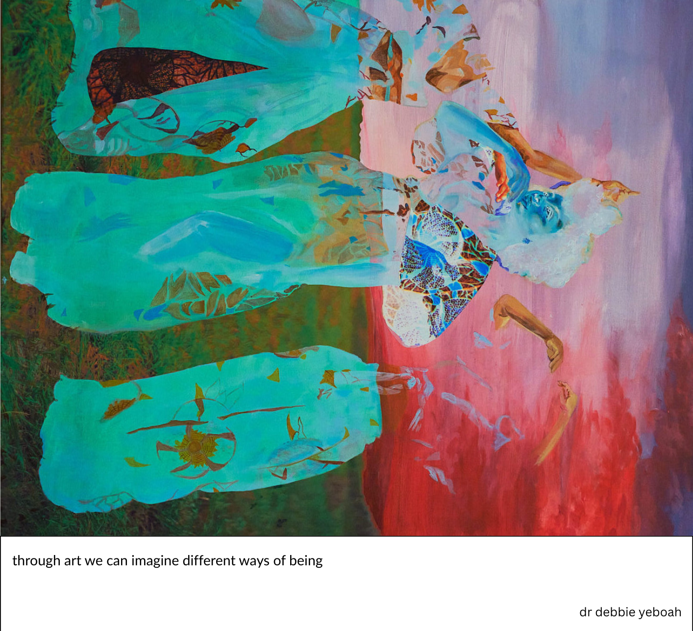
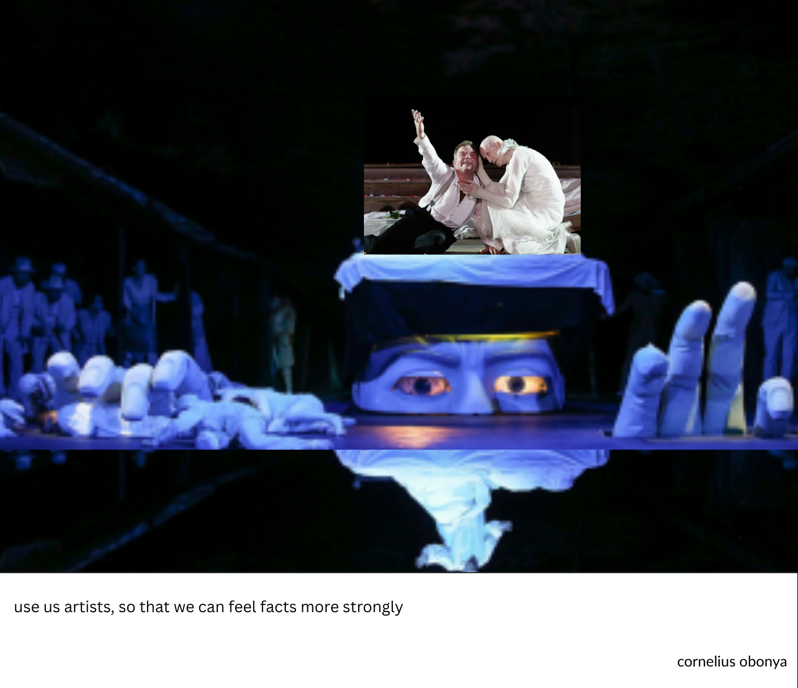

# m a k i n g &#124; m o v e m e n t s

### counterculture creative collective

---

<figcaption><small><em>there’s an elephant in the room — banksy</em></small></figcaption>

---

our political systems are failing us  
noone believes our leaders will solve our problems  

and the far right winning  

the old model is broken  
nothing will change  

**until we fix it**

---

we are a collective of artists exploring the question of our time:

> what would real democracy look like?

---

~~representation~~ ≠ participation  
~~politics~~ ≠ people  
~~leaders~~ ≠ collective  
~~dependence~~ ≠ agency  
~~polarisation~~ ≠ community  
~~despair~~ ≠ hope

---

  
<figcaption><small><em>through art we can imagine different ways of being — dr debbie yeboah</em></small></figcaption>

---

we  
believe in the power of creativity  
to shift culture

we make art, events and experiences  
we imagine how things could be different

to  
**create a vision of a future  
that people can believe in**

---

  
<figcaption><small><em>use us artists, so that we can feel facts more strongly — cornelius obonya</em></small></figcaption>

---

### coming up:

*postcards + paste-ups series*  
*meet-ups + studio sessions*  
*making movements podcast*  
*assembly culture project*  
*commissions, installations + activations*

---

### join us  
say hi and find out what we’re up to next 
